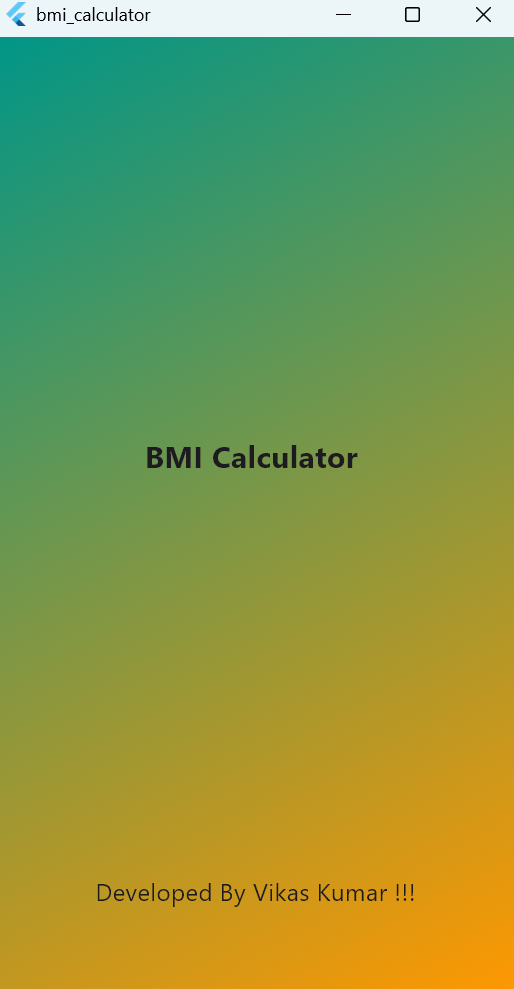
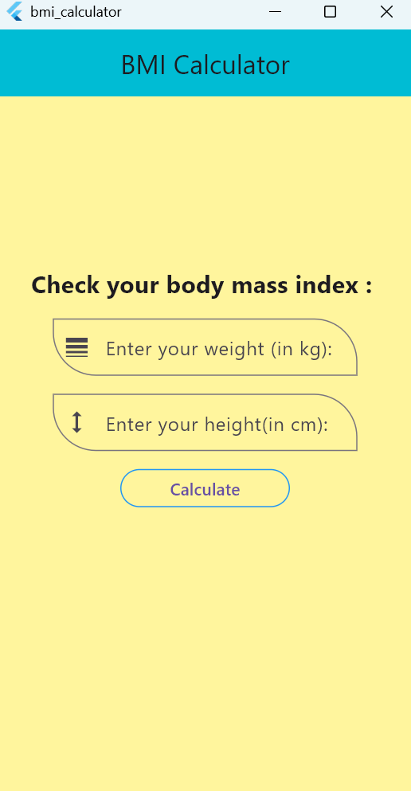
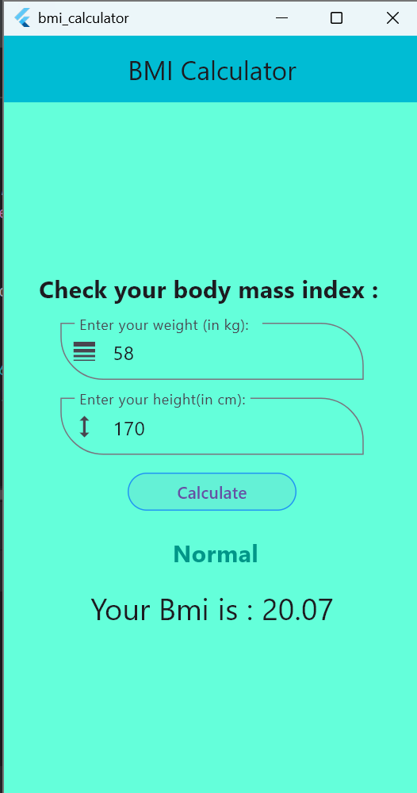

# BMI Calculator
A simple Flutter app to calculate Body Mass Index (BMI) based on user input (height and weight). It helps users track their fitness and health goals.

## Features
- Calculate BMI from height and weight
- Categorize results (Underweight, Normal, Overweight, Obese)
- Simple and clean UI
- Real-time calculation

## screenshots

## BMI Formula
[
BMI = {Weight (kg)}/{{Height (m)}^2}
]

## Getting Started

This project is a starting point for a Flutter application.

A few resources to get you started if this is your first Flutter project:

- [Lab: Write your first Flutter app](https://docs.flutter.dev/get-started/codelab)
- [Cookbook: Useful Flutter samples](https://docs.flutter.dev/cookbook)

For help getting started with Flutter development, view the
[online documentation](https://docs.flutter.dev/), which offers tutorials,
samples, guidance on mobile development, and a full API reference.
